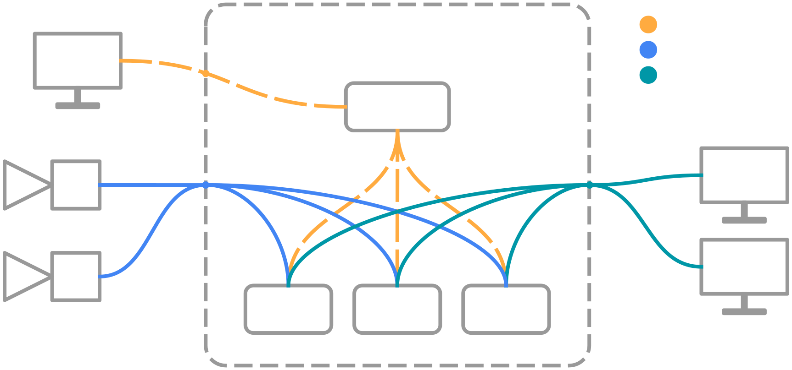
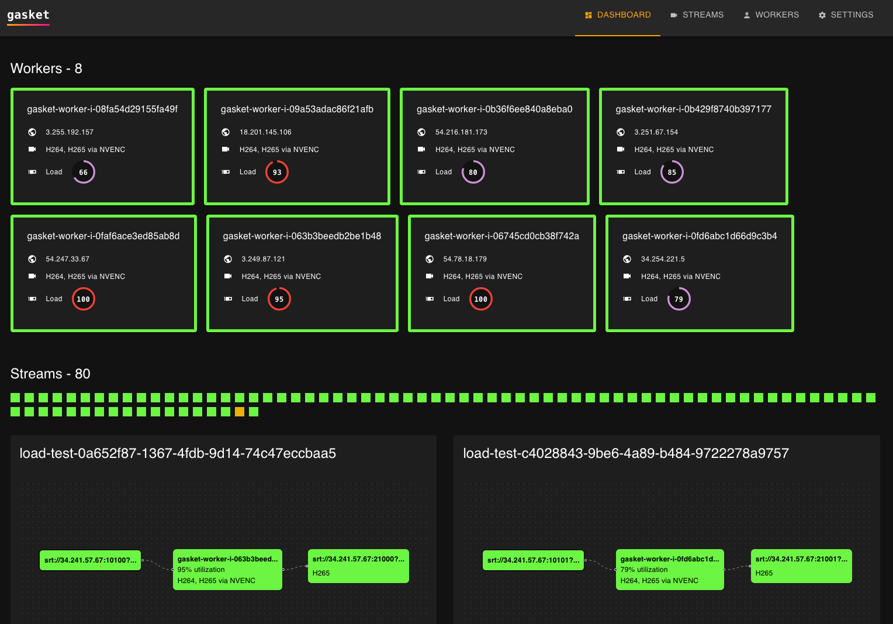

# gasket

gasket - Hardware accelerated, cloud-native transcoder

## Overview
Gasket is a software project aiming to simplify the process of transcoding live streams in Kubernetes. It is the result of a thesis project and is currently in the early stages of development. The project is being developed by [Pierre Le Fevre](https://github.com/pierrelefevre).

## Features
- Supports AMD Xilinx Alveo U30 accelerators, NVIDIA GPUs, CPUs
- React-based web interface
- Easy installation with Helm

